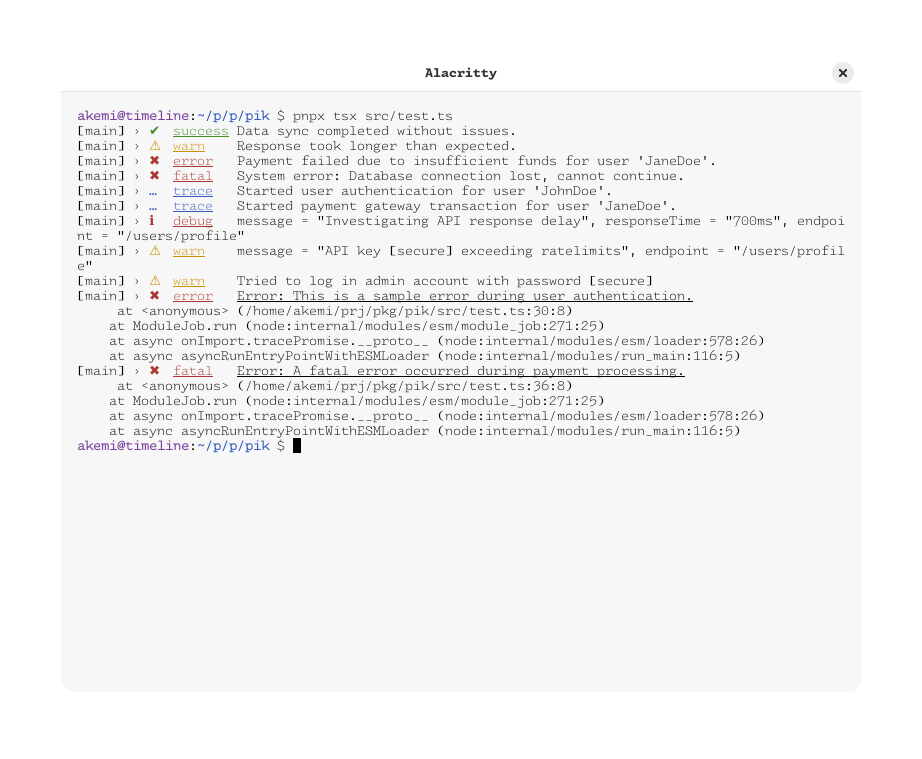

# ✨ pik**a** ぴか

a cute and shiny logger inspired by signale



## 🖥️ use

```sh
$ mkdir vendor
$ git clone https://git.sr.ht/~pixie/pik vendor/pika
$ pnpm add ./vendor/pika
```

```ts
import { pika, Level } from "pika";

const logger = pika()
  .scope("main")
  .level(Level.TRACE)
  .secrets("password123", "apiKey");

logger.success("Data sync completed without issues.");
logger.warn("Response took longer than expected.");
logger.error("Payment failed due to insufficient funds for user 'JaneDoe'.");
logger.fatal("System error: Database connection lost, cannot continue.");
logger.trace("Started user authentication for user 'JohnDoe'.");
logger.trace("Started payment gateway transaction for user 'JaneDoe'.");

logger.debug({
  message: "Investigating API response delay",
  responseTime: "700ms",
  endpoint: "/users/profile",
});

logger.warn({
  message: "API key apiKey exceeding ratelimits",
  endpoint: "/users/profile",
});

logger.warn("Tried to log in admin account with password password123");

try {
  throw new Error("This is a sample error during user authentication.");
} catch (e) {
  logger.error(e);
}

try {
  throw new Error("A fatal error occurred during payment processing.");
} catch (e) {
  logger.fatal(e);
}
```

## 🖥️ dev

```sh
$ nix develop
$ pnpm install
```

<details>
  <summary>dependencies for contributors</summary>
  
  ```sh
  cargo install --locked koji
  corepack use pnpm
  ```

</details>
